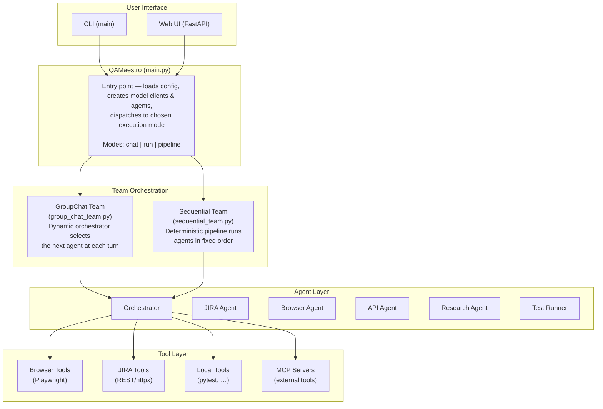
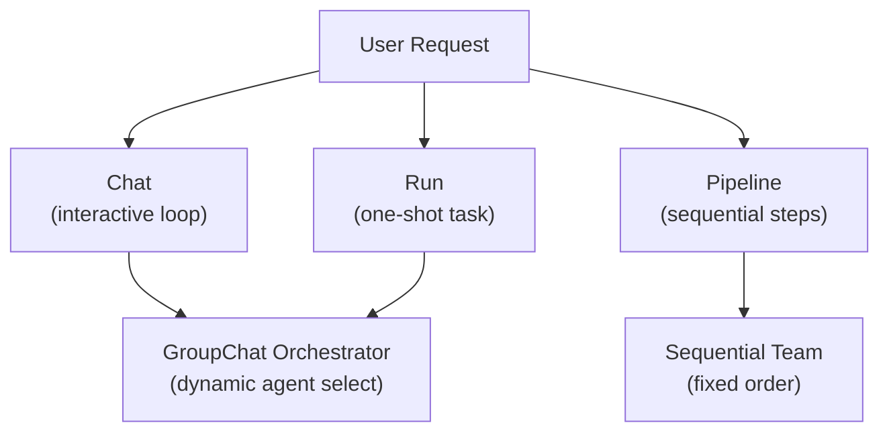
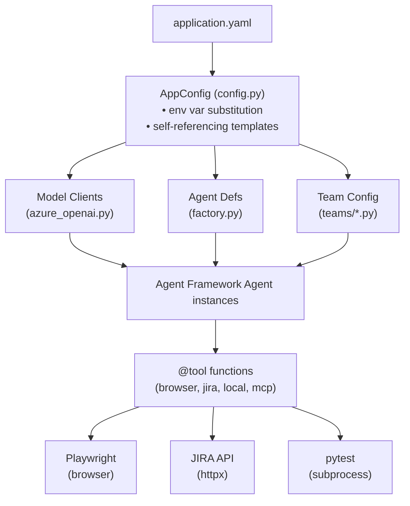
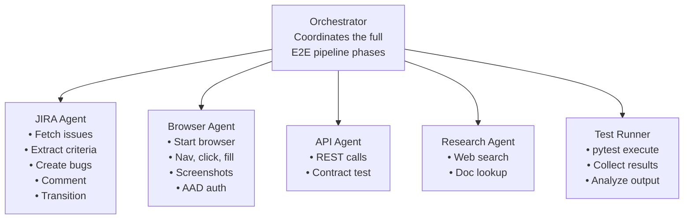
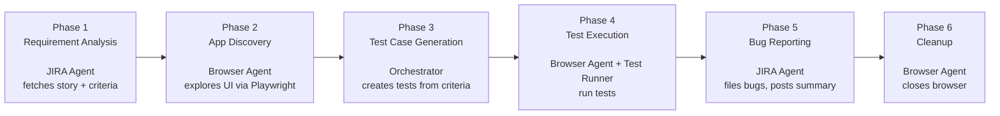
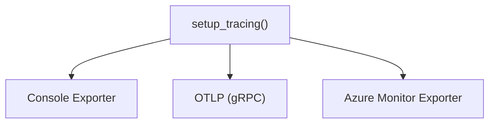
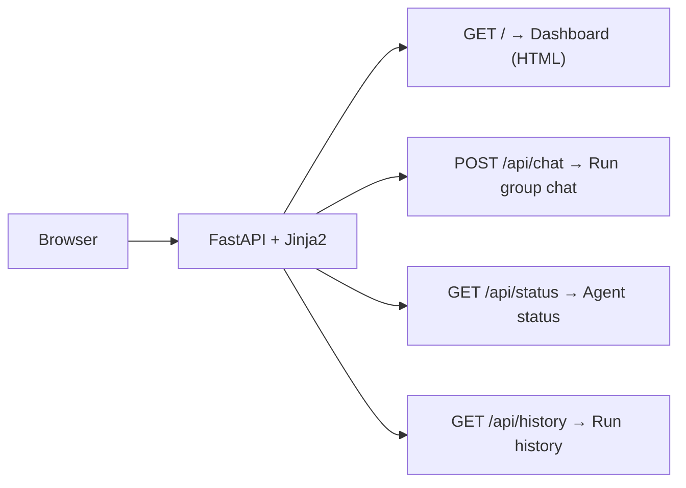

# Architecture — Agentic QA Maestro

> Multi-agent QA automation powered by [Microsoft Agent Framework](https://github.com/microsoft/agent-framework).

---

## High-Level Overview



---

## Execution Modes



| Mode | Orchestration | Use Case |
|------|---------------|----------|
| **Chat** | GroupChat (dynamic) | Exploratory QA — user types tasks interactively |
| **Run** | GroupChat (dynamic) | One-shot task execution |
| **Pipeline** | Sequential (fixed) | Reproducible E2E pipelines in defined order |

---

## Data Flow



---

## Agent Roles



---

## E2E Pipeline Phases



---

## Component Details

### Configuration (`config.py`)

Loads `application.yaml` with two substitution passes:

1. **Environment variables**: `${env:AZURE_OPENAI_API_KEY}` → value from env
2. **Self-references**: `${this:models.default.endpoint}` → value from config

Exposes typed sections: `.models`, `.agents`, `.teams`, `.mcp_servers`, `.observability`, `.web_ui`

### Model Client Factory (`models/azure_openai.py`)

- Creates `OpenAIChatCompletionClient` instances for Azure OpenAI
- Supports API key or `DefaultAzureCredential` (Azure AD)
- Auto-detects SSL certificate bundles for corporate proxy environments

### Agent Factory (`agents/factory.py`)

- Maps YAML agent definitions → Agent Framework `Agent` objects
- Assigns tools and model clients per agent
- Provides default system prompts for each role

### Tool Layer

| Module | Tools | External Dependency |
|--------|-------|---------------------|
| `browser_tools.py` | `start_browser`, `open_url`, `click`, `fill`, `select_option`, `wait_for_selector`, `get_text`, `get_page_content`, `screenshot`, `check_browser`, `close_browser`, `authenticate_aad` | Playwright (Chromium) |
| `jira_tools.py` | `jira_get_issue`, `jira_add_comment`, `jira_get_comments`, `jira_search_issues`, `jira_create_issue`, `jira_create_bug`, `jira_transition_issue` | JIRA REST API (httpx) |
| `local_tools.py` | `get_current_time`, `run_pytest`, `collect_pytest_tests` | pytest (subprocess) |

### Observability (`observability/tracing.py`)



- OpenTelemetry tracing with configurable exporters
- Structured Python logging with suppression of noisy libraries

### Web UI (`web_ui/app.py`)



---

## Design Patterns

| Pattern | Where | Purpose |
|---------|-------|---------|
| **Factory** | `create_model_clients_from_config()`, `create_agents_from_config()`, `create_*_team()` | Decouple creation from config |
| **Singleton** | Browser state in `browser_tools.py` (module-level globals + single-thread executor) | One browser instance, thread-safe |
| **Strategy** | AAD auth methods (`header`, `token_url`, `easyauth`, `msal_cache`); orchestration modes | Swap behavior at runtime |
| **Decorator** | `@tool(approval_mode=...)` on all tool functions | Register functions as Agent Framework tools |
| **Template Method** | `AppConfig._apply_substitutions()` | Recursive config resolution |

---

## Directory Structure

```
agentic-qa-maestro/
├── ARCHITECTURE.md            ← You are here
├── application.yaml           # All config: models, agents, teams, observability
├── pyproject.toml             # Package metadata & dependencies
├── example.env                # Template for environment variables
│
├── agentic_qa_maestro/
│   ├── main.py                # QAMaestro class & CLI entry point
│   ├── config.py              # YAML loader with env/self-ref substitution
│   │
│   ├── agents/
│   │   └── factory.py         # Agent creation from config
│   │
│   ├── models/
│   │   └── azure_openai.py    # Azure OpenAI client factory
│   │
│   ├── teams/
│   │   ├── group_chat_team.py # GroupChatBuilder orchestration
│   │   └── sequential_team.py # SequentialBuilder pipelines
│   │
│   ├── tools/
│   │   ├── browser_tools.py   # Playwright browser automation
│   │   ├── jira_tools.py      # JIRA REST API client
│   │   └── local_tools.py     # pytest runner, time utilities
│   │
│   ├── observability/
│   │   └── tracing.py         # OpenTelemetry + logging setup
│   │
│   └── web_ui/
│       ├── app.py             # FastAPI dashboard
│       └── templates/
│           └── index.html     # Dark-theme chat UI
│
├── scripts/
│   ├── run_e2e_pipeline.py    # Full 6-phase E2E runner
│   └── run_jira_pipeline.py   # Lightweight JIRA-only runner
│
└── tests/
    └── unit/                  # Unit tests
```

---

## Technology Stack

| Layer | Technology |
|-------|-----------|
| Agent Framework | Microsoft Agent Framework |
| LLM Provider | Azure OpenAI (GPT-4.1) |
| Browser Automation | Playwright (Chromium) |
| Issue Tracking | JIRA (REST API via httpx) |
| Test Execution | pytest (subprocess) |
| Web Framework | FastAPI + Uvicorn + Jinja2 |
| Observability | OpenTelemetry (console / OTLP / Azure Monitor) |
| Auth | Azure Identity (DefaultAzureCredential / API keys) |
| Config | YAML + python-dotenv |
| Language | Python 3.10+ |
