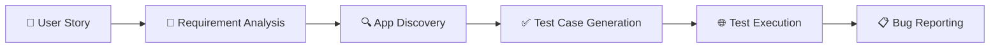

# Agentic QA Maestro

[](https://github.com/AmadeusITGroup/agentic-qa-maestro/actions/workflows/ci.yml)
[](https://pypi.org/project/agentic-qa-maestro/)
[](https://pypi.org/project/agentic-qa-maestro/)
[](LICENSE)
[](CONTRIBUTING.md)

**AI-powered QA automation that turns User stories into executed tests — no scripting required.**

Give it a ticket, and it will:

1. Read the acceptance criteria
2. Generate test cases
3. Run them in a real browser (Playwright)
4. Report pass/fail results back to your ticketing system

---

## How It Works



QA Maestro runs a **6-phase pipeline**:

| Phase | What Happens |
|-------|-------------|
| 1. Requirement Analysis | Fetches the ticket and extracts acceptance criteria |
| 2. App Discovery | Launches a browser, explores the live app UI, maps selectors and navigation |
| 2.5 Knowledge Enrichment | Loads pre-recorded app flows & known selectors from `app_flows/*.yaml` |
| 3. Test Case Generation | Combines requirements + live discovery + app knowledge to generate test cases |
| 4. Test Execution | Runs each test case against the live app, takes screenshots as evidence |
| 5. Bug Reporting | Files bug tickets for failures, posts a summary to the original story |
| 6. Cleanup | Closes the browser, outputs final pass/fail status |

### Agents

| Agent | Role |
|-------|------|
| **Orchestrator** | Coordinates the pipeline end-to-end |
| **JIRA Agent** | Reads stories, extracts criteria, posts results, files bugs |
| **Browser Agent** | Explores the app (live discovery) and executes tests via Playwright |
| **App Knowledge Agent** | Loads pre-recorded app flows, selectors, and feature maps |
| **Test Runner** | Runs pytest suites and collects results |
| **API Agent** | Validates REST endpoints against contracts |
| **Research Agent** | Looks up documentation when needed |

---

## Get Started

```bash
pip install agentic-qa-maestro    # or: uv tool install agentic-qa-maestro
qa-maestro init                   # scaffold application.yaml, .env, and app_flows/
playwright install chromium       # required once for full browser E2E
qa-maestro --ticket PROJ-123      # run against a ticket
```

See the [Getting Started guide](GETTINGSTARTED.md) for full installation, configuration, and usage instructions.

---

## Documentation

| Guide | Description |
|-------|-------------|
| [Getting Started](GETTINGSTARTED.md) | Full setup, configuration & first run |
| [Architecture](ARCHITECTURE.md) | System design & component details |
| [Contributing](CONTRIBUTING.md) | How to contribute |

---

## Contributing

We welcome contributions! See [CONTRIBUTING.md](CONTRIBUTING.md) for guidelines.

## License

Apache-2.0 — see [LICENSE](LICENSE) for details.
