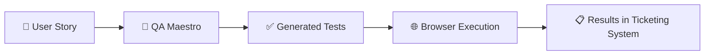

# Agentic QA Maestro

[](https://github.com/AmadeusITGroup/agentic-qa-maestro/actions/workflows/ci.yml)
[](https://pypi.org/project/agentic-qa-maestro/)
[](https://pypi.org/project/agentic-qa-maestro/)
[](LICENSE)
[](CONTRIBUTING.md)

**AI-powered QA automation that turns User stories into executed tests — no scripting required.**

Give it a ticket, and it will:

1. Read the acceptance criteria
2. Generate test cases
3. Run them in a real browser (Playwright)
4. Report pass/fail results back to your ticketing system

---

## How It Works



Under the hood, QA Maestro uses multiple AI agents (powered by [Microsoft Agent Framework](https://github.com/microsoft/agent-framework)) that collaborate to complete the testing workflow:

| Agent | Role |
|-------|------|
| **Orchestrator** | Coordinates the overall test pipeline |
| **JIRA Agent** | Reads stories, posts results, files bugs |
| **Browser Agent** | Navigates and interacts with the web app |
| **Test Runner** | Executes pytest suites and collects results |
| **API Agent** | Validates REST endpoints against contracts |
| **Research Agent** | Looks up documentation when needed |

---

## Get Started

```bash
pip install agentic-qa-maestro    # or: uv tool install agentic-qa-maestro
cp example.env .env               # add your Azure OpenAI + JIRA credentials
qa-maestro --ticket PROJ-123      # run against a ticket
```

See the [Getting Started guide](GETTINGSTARTED.md) for full installation, configuration, and usage instructions.

---

## Documentation

| Guide | Description |
|-------|-------------|
| [Getting Started](GETTINGSTARTED.md) | Full setup, configuration & first run |
| [Architecture](ARCHITECTURE.md) | System design & component details |
| [Contributing](CONTRIBUTING.md) | How to contribute |
| [Changelog](CHANGELOG.md) | Release history |

---

## Contributing

We welcome contributions! See [CONTRIBUTING.md](CONTRIBUTING.md) for guidelines.

## License

Apache-2.0 — see [LICENSE](LICENSE) for details.
